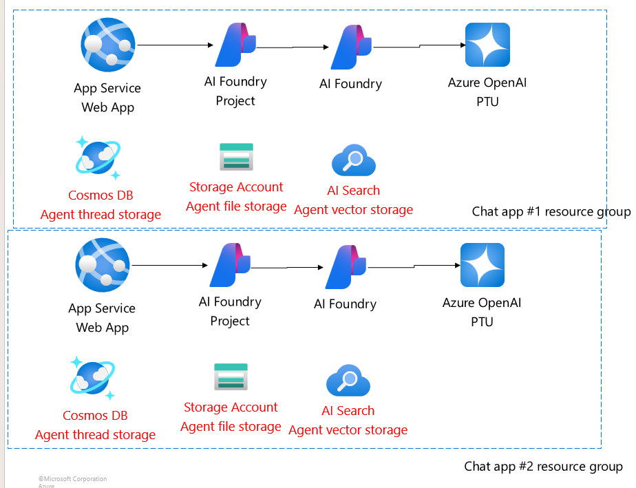
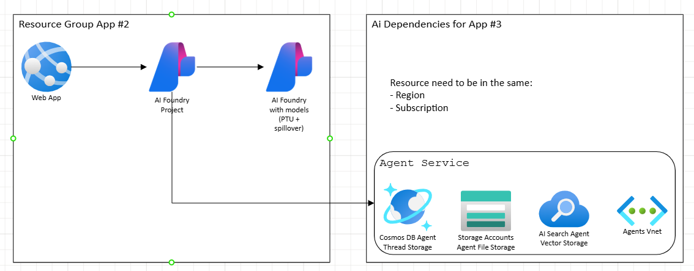
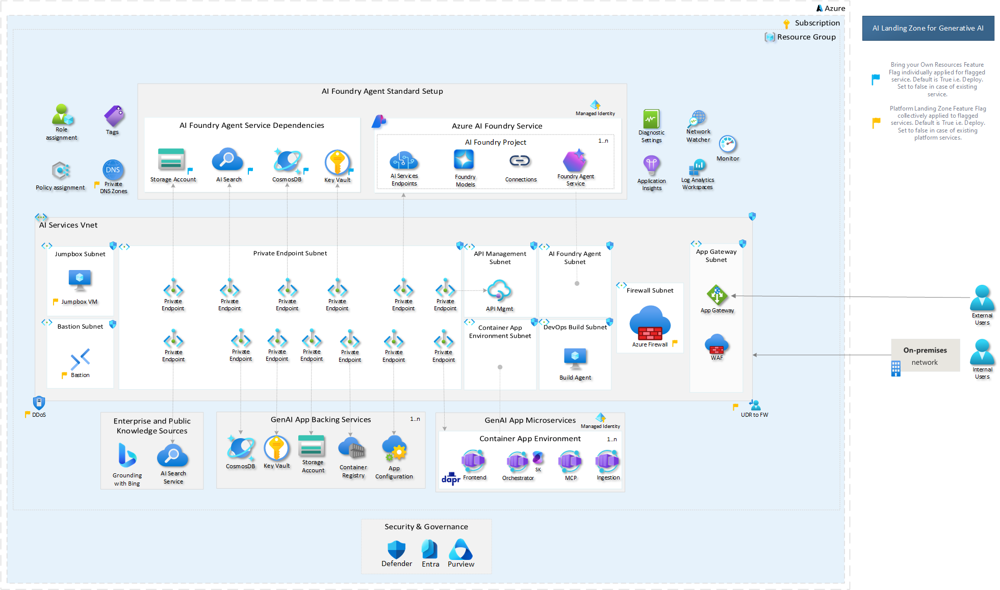
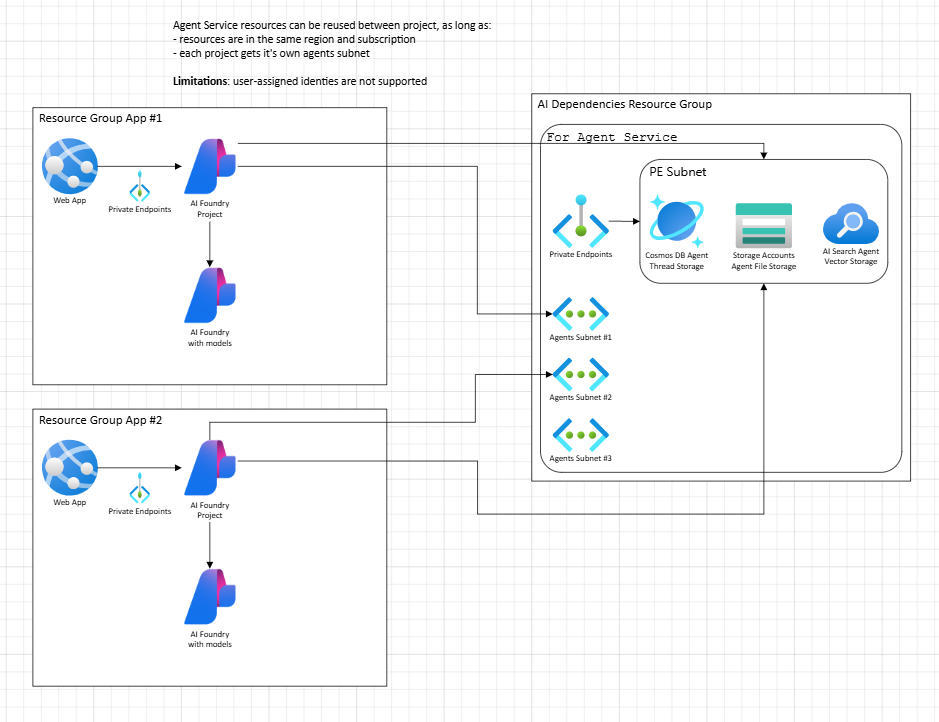
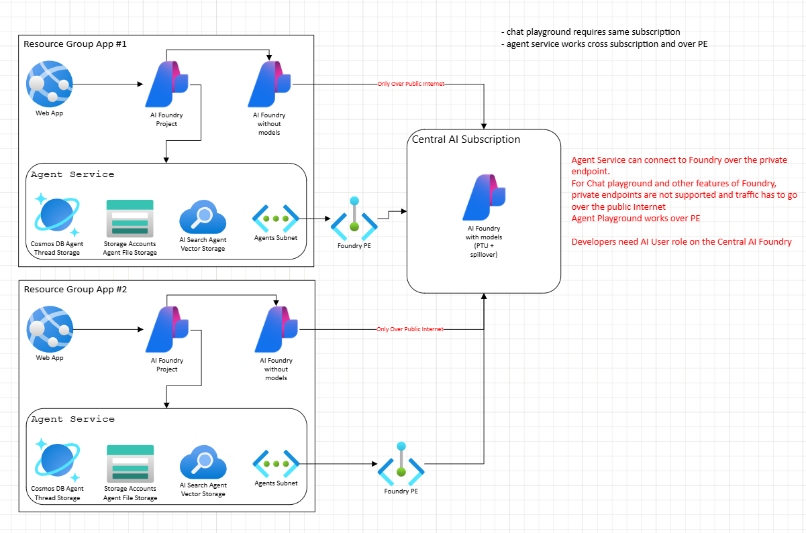
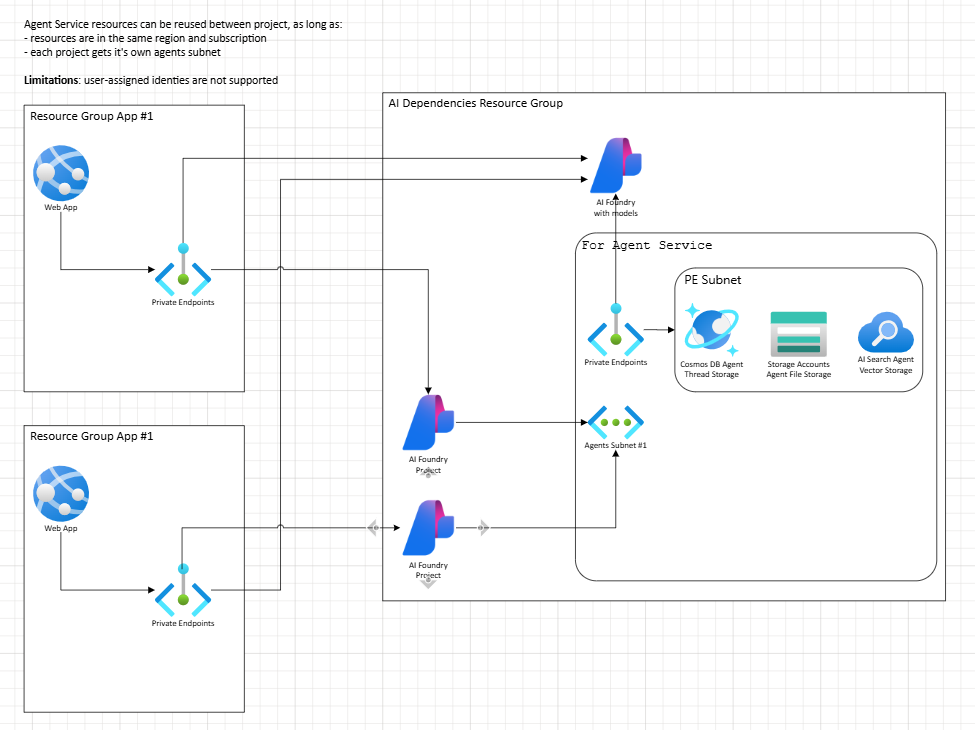
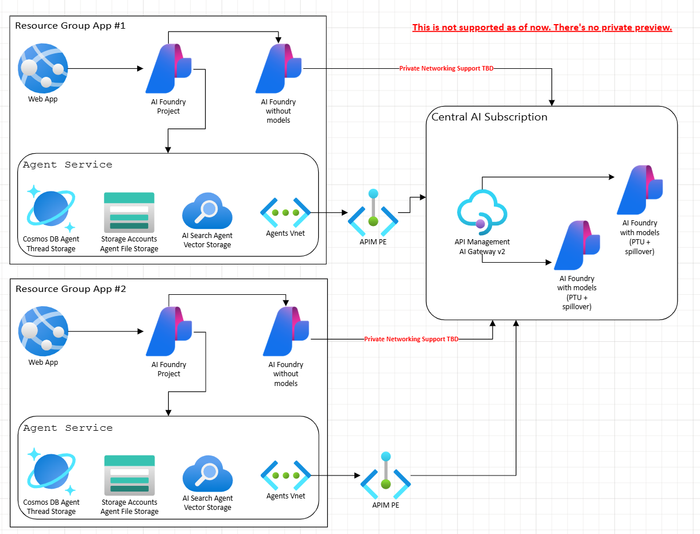

> **AI Foundry Config Testing**
>
> This repository provides Bicep templates and deployment instructions for setting up Azure AI Foundry landing zones with various networking and resource sharing options. It is intended for Azure administrators and application teams deploying AI workloads with private networking, BYO resources, and cost management best practices.
>
> **Last updated:** July 31, 2025
>

# AI Foundry landing zone options

## Table of Contents

- [Overview](#ai-foundry-landing-zone-options)
- [Standard Network Setup](#ai-foundry-standard-network-standard-setup)
- [Cost Management](#cost-management)
- [Deployment Options](#option-1---nothing-shared)
- [Deployment Instructions](#deployment-instructions)
- [Troubleshooting](#troubleshooting)

## AI Foundry Standard Network Standard Setup

In this setup, AI Foundry is deployed with BYO resources and Network.

Network and BYO resources apply only to Agent Service, not to other features of Foundry.

>[!IMPORTANT]
> BYO Network requires BYO Storage and cannot be applied separately.

Infrastructure is using Bicep files provided by the Product Team in [15 private network standard agent setup](https://github.com/azure-ai-foundry/foundry-samples/tree/main/samples/microsoft/infrastructure-setup/15-private-network-standard-agent-setup).

Agent Service uses:
 
* **Cosmos DB** for thread management
* **Azure OpenAI** for models
* **Storage** for file storage
* **AI Search** for agent indexes
* **Subnet** for certain Agent tool execution (OpenAPI, MCP, etc.)

> [!WARNING]
> Your existing Azure Cosmos DB for NoSQL account used in a standard setup must have a total throughput limit of at least 3000 RU/s. Both provisioned throughput and serverless are supported.
> Three containers will be provisioned in your existing Cosmos DB account, each requiring 1000 RU/s

> [!NOTE]
> Currently there's no way to manage cost of shared resources (Cosmos, Search) in order to execute chargeback to application teams.

 Azure AI Foundry Agent Service offers Standard Setup with private networking environment setup, allowing you to bring your own [(BYO) private virtual network](https://learn.microsoft.com/en-us/azure/ai-foundry/agents/how-to/virtual-networks).

## Cost management

### Cost of models

Currently AI Foundry does not offer cost metrics per project.
All models deployed on the foundry instance are shared with all the projects.

>[!INFORMATION]
> Agent Service is deployed and configured in each project. It supports BYO models through a connection to an external foundry resource.

### Cost of dependent resources

For Foundry Standard deployment (BYO network and storage), all dependent resources CAN be shared between projects or multiple foundries.

> [!WARNING]
> Deployed agents may serve varied use cases which utilize dependent resources (artifacts in storage, indexes in search, threads in Cosmos DB). It's important to monitor usage (especially for Cosmos DB), scale when needed.

### Key Information

**Limited Region Support for Class A Subnet IPs**
- Class A subnet support is only available in select regions and requires allowlisting of your subscription ID. Supported regions: West US, East US, East US 2, Central US, Japan East, France Central, [New] Spain Central, [New] UAE North

**Region and Resource Placement Requirements**
- **All Foundry workspace resources should be in the same region as the VNet**, including CosmosDB, Storage Account, AI Search, Foundry Account, Project, Managed Identity. The only exception is within the Foundry Account, you may choose to deploy your model to a different region, and any cross-region communication will be handled securely within our network infrastructure.
  - **Note:** Your dependent resources can be in a different resource group (including VNET) but have to be in the same region and subscription.

> [!NOTE]
> Shared AI resource has to be of kind `AIServices` in order to support all models not only OpenAI.

## Option 1 - nothing shared


Each application deploys its own "AI Landing Zone".

For cleaner deployments, it's possible to separate internal, Agents Service resources (Cosmos DB, Storage, AI Search, VNET, Private Endpoints, DNS, etc.) into separate Resource Group.



>[!NOTE]
> Sample deployment with two resource groups is available at [Bicep](./options-infra/main-option-3.bicep)

### Share nothing - AI Landing Zone
More complex example available at [AI Landing Zone](https://github.com/Azure/AI-Landing-Zones)
 


## Option 2 - shared AI dependencies



AI Dependencies can be shared between the projects when:
1. All resources are in the same subscription.
2. All resources are in the same region.
3. Each AI Foundry is injected with its own, unique subnet for the Agents Service.

>[!NOTE]
> Sample deployment with sharing AI Dependencies is available at [Bicep](./options-infra/main-option-3.bicep)

## Option 3 - shared AI Foundry models

Agents Service can use external AI Foundry connections, as long as:
1. External AI Foundry is linked to Agent Service via capability host
2. External AI Foundry is in the same region

It doesn't have to be in the same subscription (!).

Support is limited only to Agent Service, when using private endpoints.

Chat playground works only with public external Foundry in the same subscription.



 >[!NOTE]
> Sample deployment external AI Foundry is available at [Bicep](./options-infra/main-option-2.bicep) as well as [Bicep](./options-infra/main-option-3.bicep).

> [!NOTE]
> OpenAI can use the [spillover feature (preview) for provisioned deployments](https://learn.microsoft.com/en-us/azure/ai-services/openai/how-to/spillover-traffic-management
)

### Tutorials and materials

* [Using existing OpenAI resource](https://learn.microsoft.com/en-us/azure/ai-foundry/agents/how-to/use-your-own-resources#basic-agent-setup-use-an-existing-azure-openai-resource)

## Option 4 - Shared Foundry with project per application



Projects have to be deployed to the same resource group as AI Foundry, but can be shared with Application Teams.

Each application team can use their project with models hosted by Foundry.

 >[!NOTE]
> Sample deployment for two-project solution is available here: [Bicep](./options-infra/main-option-4.bicep)

## Option 45 - using AI Gateway (APIM) 

Azure API Management can be used as [AI Gateway](https://learn.microsoft.com/en-us/azure/api-management/genai-gateway-capabilities) for AI Foundry.

> [!WARNING]
> AI Gateway for Foundry is currently not supported.

 

### Tutorials and materials

* [AI Gateway Workshop](https://azure-samples.github.io/AI-Gateway/)
* [AI Gateway Samples](https://github.com/Azure-Samples/ai-gateway)
 

## Deployment Instructions

### Prerequisites

* Azure CLI installed and configured
* Appropriate permissions (Contributor or Owner access) to your Azure subscription/resource group
* Azure subscription with quota for AI services

### Steps to Deploy

1. **Navigate to the infrastructure directory:**

   ```bash
   cd "options-infra"
   ```

2. **Login to Azure (if not already logged in):**

   ```bash
   az login
   ```

3. **Set your subscription (if you have multiple):**

   ```bash
   az account set --subscription "your-subscription-id-or-name"
   ```

4. **Create a resource group (if it doesn't exist):**

   ```bash
   az group create --name "rg-ai-foundry-config" --location "eastus2"
   ```

5. **Deploy the Bicep template using the parameters file:**

   **Option 1 - Just Foundry:**
   ```bash
   az deployment group create `
     --resource-group "rg-ai-foundry-config" `
     --template-file "main-option-1.bicep" `
     --parameters "main.-option-1.bicepparam" `
     --verbose
   ```

   **Option 2 - AI Foundry with external AI resource**
   ```bash
   az deployment group create `
     --resource-group "rg-ai-foundry-config" `
     --template-file "main-option-2.bicep" `
     --parameters "main.-option-2.bicepparam" `
     --verbose
   ```

   **Option 3 - two resource groups - one for app - one for AI dependencies:**
   ```bash
   az deployment sub create `
     --location westus `
     --template-file "main-option-3.bicep" `
     --parameters "main.-option-3.bicepparam" `
     --verbose
   ```

   **Option 4 - AI Foundry with multiple projects:**
   ```bash
   az deployment group create `
     --resource-group "rg-ai-foundry-config" `
     --template-file "main-option-4.bicep" `
     --parameters "main.-option-4.bicepparam" `
     --verbose
   ```


**Configuration Notes:**
Create your own configuration file: `main.-option-3.local.bicepparam` and use in the deployment.

* **Location**: Set to `eastus2` - you can change this to your preferred Azure region that supports AI services
* **Existing AOAI Resource**: 
  - Provide the full resource ID of your existing Azure OpenAI resource

> [!IMPORTANT]
> When using an existing Azure OpenAI resource (Options 2-4), ensure that:
>
> * The Azure OpenAI resource and AI Foundry account are deployed in the same region
> * You have appropriate permissions to access the existing Azure OpenAI resource
> * The existing Azure OpenAI resource has the required model deployments

### Alternative Deployment Methods

**Deploy with inline parameters (example for Option 2):**

```bash
az deployment group create `
  --resource-group "rg-ai-foundry-config" `
  --template-file "main-option-2.bicep" `
  --parameters location="eastus2" existingAoaiResourceId="/subscriptions/1c083bf3-30ac-4804-aa81-afddc58c78dc/resourceGroups/aoai-rgp-02/providers/Microsoft.CognitiveServices/accounts/aoai-02" `
  --verbose
```

### Troubleshooting

* If you get permission errors, ensure your account has Owner access to the subscription/resource group
* If model deployments fail, check that your subscription has quota for the AI models
* For RBAC or role assignment problems, confirm your identity and permissions
* Use `--verbose` flag for more detailed output if needed
* Ensure Azure OpenAI resource and Azure AI Foundry account are in the same region
* For deployment failures, review error messages and consult [Azure documentation](https://learn.microsoft.com/en-us/azure/ai-foundry/agents/how-to/use-your-own-resources)
