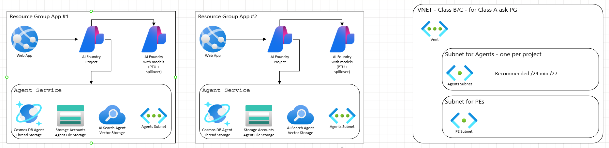

# AI Foundry landing zone options

## Open items

- [ ] how to manage the cost of shared Azure OpenAI without APIM
  - [ ] should each foundry use it's own Cosmos DB since it's PAYGO ?
  - [ ] confirm when APIM for AI Foundry will be available in private preview / GA.
- [ ] how to manage cost of other shared resources (Cosmos, Search itp.)
- [ ] can all the foundries share the same Agents VNET?
- [ ] what IAM roles to apply for Devs vs. Admins? Devs should not be able to deploy models.

## AI Foundry Standard Network Standard Setup

In this setup, AI Foundry is deployed with BYO resources and Network.

Network and BYO resources apply only to Agent Service, not to other features of Foundry.

### Key Information

**Limited Region Support for Class A Subnet IPs**
- Class A subnet support is only available in select regions and requires allowlisting of your subscription ID. Supported regions: West US, East US, East US 2, Central US, Japan East, France Central, [New] Spain Central, [New] UAE North

**Region and Resource Placement Requirements**
- **All Foundry workspace resources should be in the same region as the VNet**, including CosmosDB, Storage Account, AI Search, Foundry Account, Project, Managed Identity. The only exception is within the Foundry Account, you may choose to deploy your model to a different region, and any cross-region communication will be handled securely within our network infrastructure.
  - **Note:** Your Virtual Network can be in a different resource group than your Foundry workspace resources 

> [!NOTE]
> Shared AI resource has to be of kind `AIServices` in order to support all models not only OpenAI.

## Option 1 - nothing shared
 
 
## Option 2 - shared AOAI

Each team deploys their own AI Foundry with a connection to shared Azure OpenAI.

 

> [!NOTE]
> OpenAI can use the [spillover feature (preview) for provisioned deployments](https://learn.microsoft.com/en-us/azure/ai-services/openai/how-to/spillover-traffic-management
)

> [!WARNING]
> Azure OpenAI resource and Azure AI Foundry account and project must be in the same region.

### Tutorials and materials

* [Using existing OpenAI resource](https://learn.microsoft.com/en-us/azure/ai-foundry/agents/how-to/use-your-own-resources#basic-agent-setup-use-an-existing-azure-openai-resource)

## Option 3 - using AI Gateway (APIM)

Azure API Management can be use as [AI Gateway](https://learn.microsoft.com/en-us/azure/api-management/genai-gateway-capabilities) for AI Foundry.

> [!WARNING]
> AI Gateway for Foundry is currently in private preview supporting Foundry Hub (ML) deployment model.

 

### Tutorials and materials

* [AI Gateway Workshop](https://azure-samples.github.io/AI-Gateway/)
* [AI Gateway Samples](https://github.com/Azure-Samples/ai-gateway)
 
## Option 4 - Shared Azure Open AI and Agent Service resources

Using Foundry with own resources:
 
* **Cosmos DB** for thread management
* **Azure OpenAI** for models
* **Storage** for file storage
* **AI Search** for agent indexes

> [!WARNING]
> Your existing Azure Cosmos DB for NoSQL account used in a standard setup must have a total throughput limit of at least 3000 RU/s. Both provisioned throughput and serverless are supported.
> Three containers will be provisioned in your existing Cosmos DB account, each requiring 1000 RU/s

> [!NOTE]
> Currently there's no way to manage cost of shared resources (Cosmos, Search) in order to execute chargback to application teams.


 ## Agent VNET

 Azure AI Foundry Agent Service offers Standard Setup with private networking environment setup, allowing you to bring your own [(BYO) private virtual network](https://learn.microsoft.com/en-us/azure/ai-foundry/agents/how-to/virtual-networks).

## Deployment Instructions

### Prerequisites

* Azure CLI installed and configured
* Appropriate permissions (Contributor access) to your Azure subscription/resource group
* Azure subscription with quota for AI services

### Steps to Deploy

1. **Navigate to the infrastructure directory:**

   ```powershell
   cd "options-infra"
   ```

2. **Login to Azure (if not already logged in):**

   ```powershell
   az login
   ```

3. **Set your subscription (if you have multiple):**

   ```powershell
   az account set --subscription "your-subscription-id-or-name"
   ```

4. **Create a resource group (if it doesn't exist):**

   ```powershell
   az group create --name "rg-ai-foundry-config" --location "eastus2"
   ```

5. **Deploy the Bicep template using the parameters file:**

   **Option 1 - Nothing Shared:**
   ```powershell
   az deployment group create `
     --resource-group "rg-ai-foundry-config" `
     --template-file "main-option-1.bicep" `
     --parameters "main.-option-1.bicepparam" `
     --verbose
   ```

   **Option 2 - Shared AOAI:**
   ```powershell
   az deployment group create `
     --resource-group "rg-ai-foundry-config" `
     --template-file "main-option-2.bicep" `
     --parameters "main.-option-2.bicepparam" `
     --verbose
   ```

   **Option 3 - AI Gateway (APIM):**
   ```powershell
   az deployment group create `
     --resource-group "rg-ai-foundry-config" `
     --template-file "main-option-3.bicep" `
     --parameters "main.-option-3.bicepparam" `
     --verbose
   ```

   **Option 4 - Shared Azure OpenAI and Agent Service Resources:**
   ```powershell
   az deployment group create `
     --resource-group "rg-ai-foundry-config" `
     --template-file "main-option-4.bicep" `
     --parameters "main.-option-4.bicepparam" `
     --verbose
   ```

6. **(Optional) Preview what will be deployed with What-If:**

   ```powershell
   # Replace with your chosen option (1-4)
   az deployment group what-if `
     --resource-group "rg-ai-foundry-config" `
     --template-file "main-option-X.bicep" `
     --parameters "main.-option-X.bicepparam" `
     --verbose
   ```

### Configuration

Each deployment option uses its own parameter file:

#### Option 1 - Nothing Shared (`main.-option-1.bicepparam`)
```bicep-params
using 'main-option-1.bicep'

// Parameters for Option 1 - Everything deployed fresh
param location = 'eastus2'
param existingAoaiResourceId = ''
```

#### Option 2 - Shared AOAI (`main.-option-2.bicepparam`)
```bicep-params
using 'main-option-2.bicep'

// Parameters for Option 2 - Shared Azure OpenAI
param location = 'eastus2'
param existingAoaiResourceId = '/subscriptions/1c083bf3-30ac-4804-aa81-afddc58c78dc/resourceGroups/aoai-rgp-02/providers/Microsoft.CognitiveServices/accounts/aoai-02'
```

#### Option 3 - AI Gateway/APIM (`main.-option-3.bicepparam`)
```bicep-params
using 'main-option-3.bicep'

// Parameters for Option 3 - AI Gateway with APIM
param location = 'eastus2'
param existingAoaiResourceId = '/subscriptions/1c083bf3-30ac-4804-aa81-afddc58c78dc/resourceGroups/aoai-rgp-02/providers/Microsoft.CognitiveServices/accounts/aoai-02'
```

#### Option 4 - Shared Resources (`main.-option-4.bicepparam`)
```bicep-params
using 'main-option-4.bicep'

// Parameters for Option 4 - Shared AOAI + Agent Service resources
param location = 'eastus2'
param existingAoaiResourceId = '/subscriptions/1c083bf3-30ac-4804-aa81-afddc58c78dc/resourceGroups/aoai-rgp-02/providers/Microsoft.CognitiveServices/accounts/aoai-03'
```

**Configuration Notes:**
* **Location**: Set to `eastus2` - you can change this to your preferred Azure region that supports AI services
* **Existing AOAI Resource**: 
  - **Option 1**: Leave empty (`''`) to create all new resources
  - **Options 2-4**: Provide the full resource ID of your existing Azure OpenAI resource

> [!IMPORTANT]
> When using an existing Azure OpenAI resource (Options 2-4), ensure that:
>
> * The Azure OpenAI resource and AI Foundry account are deployed in the same region
> * You have appropriate permissions to access the existing Azure OpenAI resource
> * The existing Azure OpenAI resource has the required model deployments

### Alternative Deployment Methods

**Deploy with inline parameters (example for Option 2):**

```powershell
az deployment group create `
  --resource-group "rg-ai-foundry-config" `
  --template-file "main-option-2.bicep" `
  --parameters location="eastus2" existingAoaiResourceId="/subscriptions/1c083bf3-30ac-4804-aa81-afddc58c78dc/resourceGroups/aoai-rgp-02/providers/Microsoft.CognitiveServices/accounts/aoai-02" `
  --verbose
```

### Troubleshooting

* If you get permission errors, ensure your account has Contributor access to the subscription/resource group
* If model deployments fail, check that your subscription has quota for the AI models
* Use `--verbose` flag for more detailed output if needed
* Ensure Azure OpenAI resource and Azure AI Foundry account are in the same region
