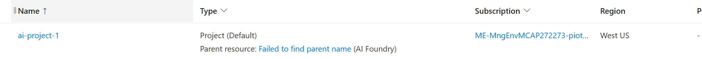
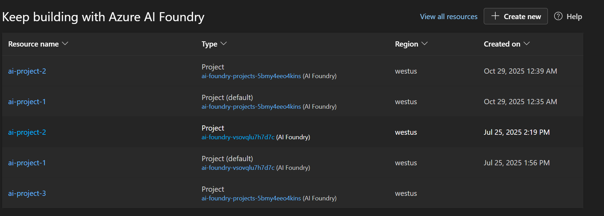
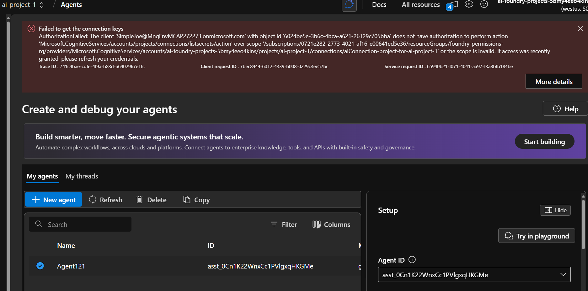
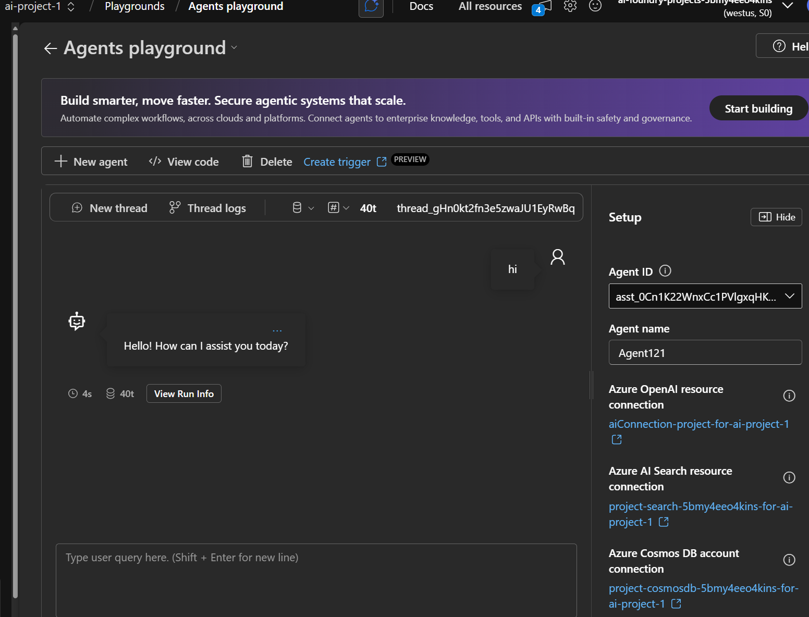

# Testing permissions for projects and Foundry

## Step 1 - just AI User

- ❌ Cannot access project

```bicep
var roleAssignments types.FoundryRoleAssignmentsType = {
  foundry: [
  ]
  project: [
    'Azure AI User'
  ]
  aiServices: [
  ]
  storage: [
  ]
  aiSearch: [
  ]
}
```
Resulted in error - Parent resource: Failed to find parent name (AI Foundry)



## Step 2 - AI User with Reader

- ✅ Able to access project
- ❌ Not able to view agents
- ❌ Cannot view models from connected resource
- ❌ All projects are visible not just one with `AI User` assignment

```bicep
var roleAssignments types.FoundryRoleAssignmentsType = {
  foundry: [
    'Reader'
  ]
  project: [
    'Azure AI User'
  ]
  aiServices: [
  ]
  storage: [
  ]
  aiSearch: [
  ]
}
```



### Errors

#### Errors in project 1 where AI User role is present

> [!ERROR]
> AuthorizationFailed: The client 'SimpleJoe@xxx.onmicrosoft.com' with object id '00000000-0000-0000-0000-000000000000' does not have authorization to perform action 'Microsoft.CognitiveServices/accounts/projects/connections/listsecrets/action' over scope '/subscriptions/00000000-0000-0000-0000-000000000000/resourceGroups/foundry-permissions-rg/providers/Microsoft.CognitiveServices/accounts/ai-foundry-projects-xxx/projects/ai-project-1/connections/aiConnection-project-for-ai-project-1

> [!ERROR]
> AuthorizationFailed: The client 'SimpleJoe@xxx.onmicrosoft.com' with object id '00000000-0000-0000-0000-000000000000' does not have authorization to perform action 'Microsoft.CognitiveServices/accounts/deployments/read' over scope '/subscriptions/00000000-0000-0000-0000-000000000000/resourcegroups/foundry-permissions-rg/providers/Microsoft.CognitiveServices/accounts/ai-foundry-with-models-xxx' or the scope is invalid. If access was recently granted, please refresh your credentials.

#### Error in project 2 where AI User role is not present

> [!ERROR] Unable to access your agents
>
> Your principal is missing the Azure AI User role. Please ask your project manager or administrator to grant you the Azure AI User RBAC role for the resource ai-foundry-projects-xxx . If the role was recently added, it may take up to 15 minutes for the changes to take effect. Learn more about permissions 


## Step 3 - AI User with Reader and Reader on connected resource

- ✅ Able to access project
- ✅ Able to view agents
- ❌ Error accessing agents
- ❌ Cannot view models from connected resource
- ❌ All projects are visible not just one with `AI User` assignment

Even though there's an error, Agent got created.

```bicep
var roleAssignments types.FoundryRoleAssignmentsType = {
  foundry: [
    'Reader'
  ]
  project: [
    'Azure AI User'
  ]
  aiServices: [
    'Reader'
  ]
  storage: [
  ]
  aiSearch: [
  ]
}
```

Even though there's an error, Agent got created.


### Errors

#### Errors in Agents screen

> [!ERROR] Failed to get the connection keys
>
> AuthorizationFailed: The client 'SimpleJoe@xxx.onmicrosoft.com' with object id '00000000-0000-0000-0000-000000000000' does not have authorization to perform action 'Microsoft.CognitiveServices/accounts/projects/connections/listsecrets/action' over scope '/subscriptions/00000000-0000-0000-0000-000000000000/resourceGroups/foundry-permissions-rg/providers/Microsoft.CognitiveServices/accounts/ai-foundry-projects-xxx/projects/ai-project-1/connections/aiConnection-project-for-ai-project-1' or the scope is invalid. If access was recently granted, please refresh your credentials.

## Step 4 - AI User with Reader and Cognitive Services OpenAI User on connected resource

- ✅ Able to access project
- ✅ Able to view agents
- ✅ Able to update agents
- ✅ Able to access agents
- ✅ Able to view models from connected resource
- ❌ Refresh page required to open agent in playground
- ❌ Error with list secrets on the agent screen
- ❌ All projects are visible not just one with `AI User` assignment

Even though there's an error, Playground works.



```bicep
var roleAssignments types.FoundryRoleAssignmentsType = {
  foundry: [
    'Reader'
  ]
  project: [
    'Azure AI User'
  ]
  aiServices: [
    'Cognitive Services OpenAI User'
  ]
  storage: [
  ]
  aiSearch: [
  ]
}
```

Agent list screen still displays the error with "list secrets", even when all connections are created with AAD.

### Errors

#### Errors in Agents screen

> [!ERROR] Failed to get the connection keys
>
> AuthorizationFailed: The client 'SimpleJoe@xxx.onmicrosoft.com' with object id '00000000-0000-0000-0000-000000000000' does not have authorization to perform action 'Microsoft.CognitiveServices/accounts/projects/connections/listsecrets/action' over scope '/subscriptions/00000000-0000-0000-0000-000000000000/resourceGroups/foundry-permissions-rg/providers/Microsoft.CognitiveServices/accounts/ai-foundry-projects-xxx/projects/ai-project-1/connections/aiConnection-project-for-ai-project-1' or the scope is invalid. If access was recently granted, please refresh your credentials.

## Step 5 - Azure AI Project Manager with Reader and Cognitive Services OpenAI User on connected resource

- ✅ Able to access project
- ✅ Able to view agents
- ✅ Able to update agents
- ✅ Able to access agents
- ✅ Able to view models from connected resource
- ❌ All projects are visible not just one with `AI Project Manager` assignment


```bicep
var roleAssignments types.FoundryRoleAssignmentsType = {
  foundry: [
    'Reader'
  ]
  project: [
    'Azure AI Project Manager'
  ]
  aiServices: [
    'Cognitive Services OpenAI User'
  ]
  storage: [
  ]
  aiSearch: [
  ]
}
```


### Errors

None